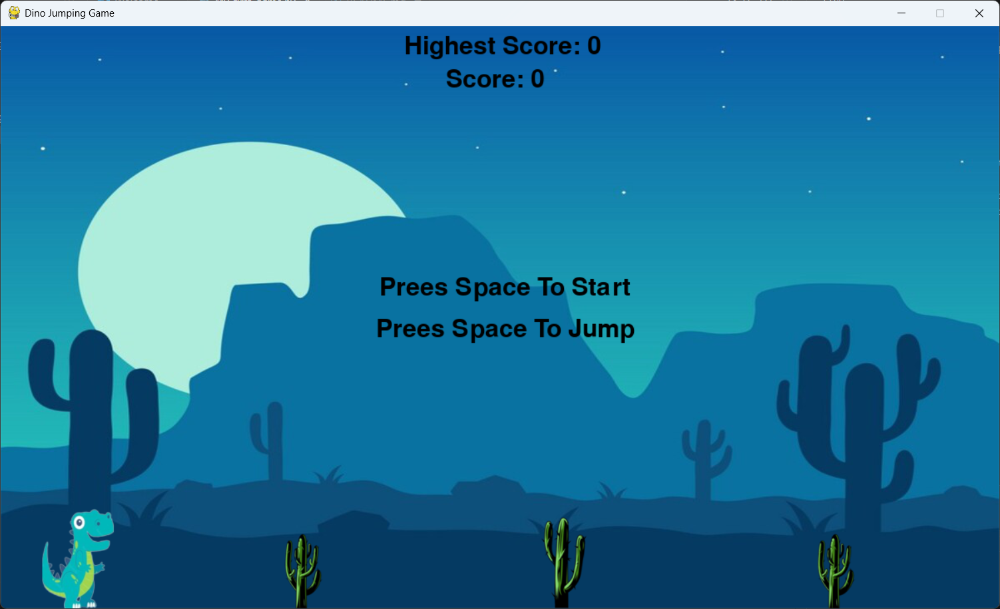

# Dino Jumping Game

A simple side-scrolling jumping game built with Python and Pygame, inspired by the classic Chrome Dino game. Control the dinosaur, jump over obstacles, and try to beat your highest score!

## Features
- Playable dinosaur character with jump mechanics
- Randomly generated cactus obstacles
- Score and highest score tracking
- Game over and restart functionality
- Pause and resume support
- Simple and colorful graphics

## Tech Used
- **Python 3**: Core programming language for game logic
- **Pygame**: Library for graphics, sound, and game loop management
- **Random**: For generating random cactus positions
- **Time**: For managing game timing and frame rate

## Controls
- **Spacebar**: Start the game, jump, or restart after game over
- **Enter**: Pause and resume the game
- **Close Window**: Quit the game

## Requirements
- Python 3.x
- Pygame

## Installation
1. Clone this repository or download the source code.
2. Install the required dependencies:
   ```bash
   pip install pygame
   ```
3. Make sure the following image files are in the same directory as `My_first_game.py`:
   - `background.jpg`
   - `dino.png`
   - `cactus.png`
   - `cactus2.png`
   - `game_over.png`

## How to Run
Run the game using Python:
```bash
python My_first_game.py
```

## Screenshots

